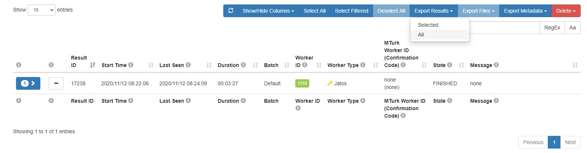
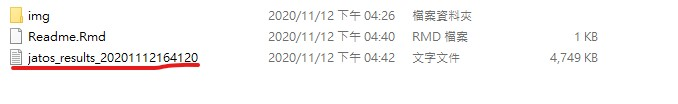
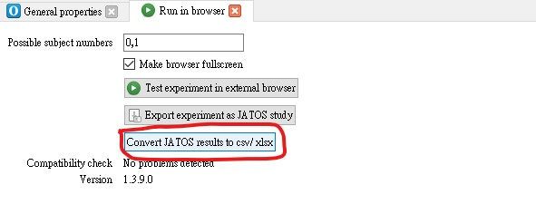
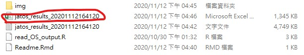
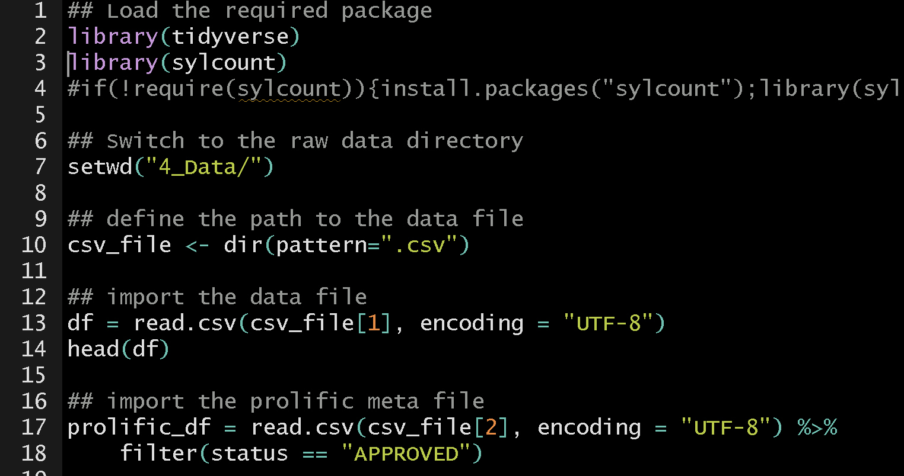
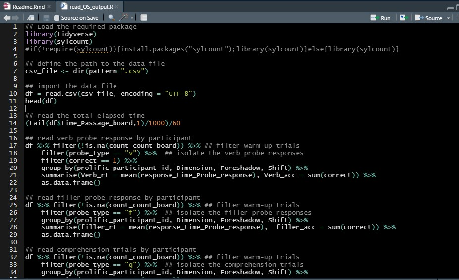
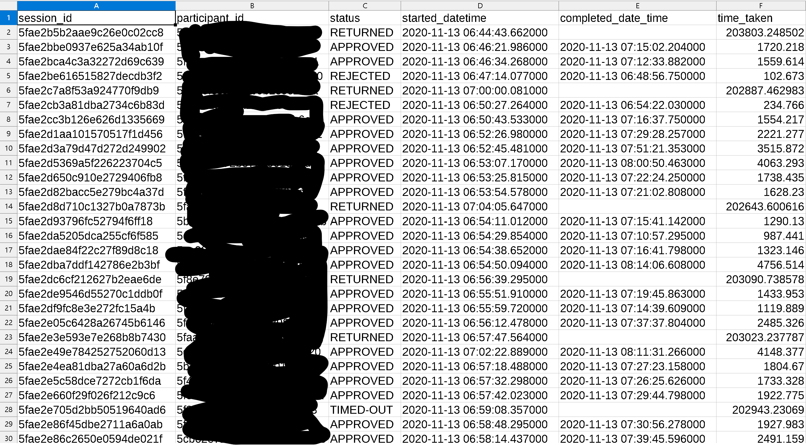

```{r setup, include=FALSE}
knitr::opts_chunk$set(echo = TRUE)
```

### Data sets 

- 2020 Nov First replication of Pettijohn and Radvansky (2016)
> `jatos_results_20201113143306.txt`, `jatos_results_20201115223512.csv`

- 2020 Dec Second replication of Pettijohn and Radvansky (2016)
> `jatos_results_20201209202930.csv`, `jatos_results_20201209202930.txt`

### Pre-processing workflow

1. Export data file (.json) from JATOS server.



2. Save the data file (.json) in `4_Data`.



3. Transfer the format of data file in OpenSesame.



4. Make sure the data file format is .csv.



5. Run `Rawdata_filter.R`. This scirpt will export the cleaned raw data and the valid participant ID.



6. Paste the id to Prolific dashboard and export the participants meta data.

<!---
5. Run `read_OS_output.R` and retrieve the participant id(s) who complete the study.



6. Paste the id to Prolific dashboard and export the participants meta data.



7. Run `Rawdata_filter.R` and export the valid rawdata for the analysis.


--->